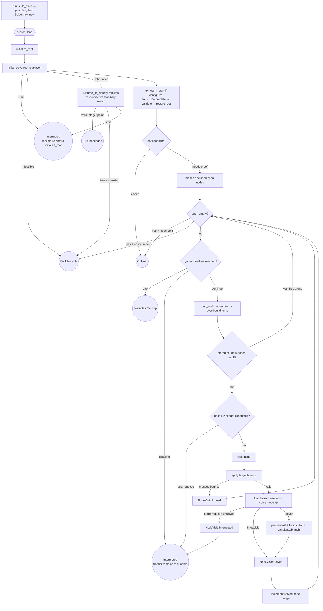
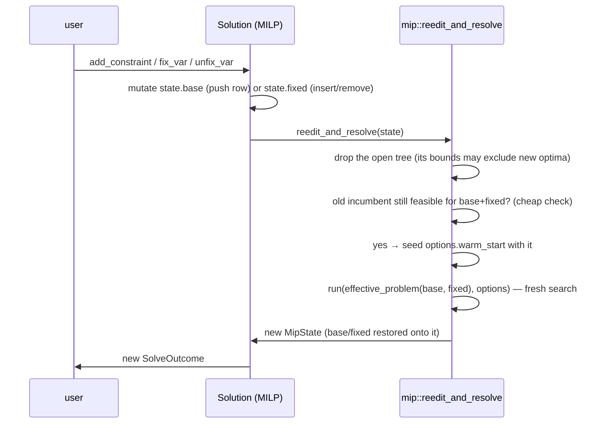

# microlp Architecture

This document explains how the solver works: how a problem flows from the public API
through the simplex engine and the branch & bound search, why the pieces are shaped the
way they are, and where to plug in improvements. It is written to be sufficient on its
own — a person (or an agent) who has read this should be able to navigate the codebase,
predict its behavior, and extend it safely.

---

## 1. The big picture

microlp solves **linear programs** (LP: continuous variables, linear constraints, linear
objective) and **mixed-integer linear programs** (MILP: same, but some variables must take
integer values). It is organized as two layers with a deliberately narrow interface between
them:

```mermaid
graph TD
    subgraph API["Public API (crate root)"]
        P[problem.rs: Problem] -->|solve / solve_with| S[solution.rs: Solution]
        O[outcome.rs: SolveOutcome<br/>expr.rs / error.rs]
    end
    subgraph MIP["MIP layer (src/mip/)"]
        D[driver: mod.rs<br/>lifecycle, entry points] --> SE[search.rs<br/>nodes, branching, loop]
        D --> ST[state.rs<br/>MipState]
        D --> O2[options.rs<br/>public option types]
        SE --> B[branching/<br/>pseudocosts]
        SE --> N[node.rs<br/>plain-data tree nodes]
        SE --> PR[params.rs<br/>internal constants]
    end
    subgraph LP["LP engine (src/solver/)"]
        SV[mod.rs: Solver<br/>bounded-variable simplex] --> TOL[tolerances.rs<br/>the tolerance model]
        SV --> SC[scaling.rs<br/>row/column scaling, seeding]
        SV --> BA[basis.rs<br/>BasisSolver, pivots]
        SV --> LU[lu/: LU factorization]
        SV --> SP[sparse/ · ordering/]
    end
    P --> D
    D -->|one persistent instance| SV
    S -->|LP: live solver<br/>MILP: plain values + MipState| D
```



Three principles shape everything:

1. **One persistent LP solver per search.** The branch & bound tree never clones the solver
   and never grows the LP. Branching is expressed purely as *variable bound changes* on the
   single `Solver` instance, and tree nodes are plain data that describe how to reconstruct
   a state on that instance.
2. **No unfinished node LP is consulted.** A deadline is observed between completed simplex
   pivots and may stop a solve before optimality. The driver pushes that node back
   **unsolved** and makes no bound, candidate, or branch decision from the unfinished state.
   The next visit rebuilds the node from its own data. Node budgets and global search
   decisions are applied between node LP solves.
3. **Loud failures over silent wrong answers.** Child-LP errors are never conflated with
   infeasibility; numerical failures either recover through a documented valve or propagate
   as errors; candidate solutions are re-validated before being accepted. Where the code
   cannot do something properly it panics with a message rather than approximating.

### Module map

| File | Responsibility |
|---|---|
| `src/lib.rs` | Crate root: the module wiring and the `pub use` re-exports that define the public API's paths. Every public item lives in a sibling module and is re-exported here, so `microlp::Problem` and friends are unaffected by where the code sits. |
| `src/problem.rs` | `Problem`, `VarDomain`, and the solve entry points. Owns solve/edit timing and the pure-LP model-to-engine seam in `Problem::solve_with` (presolve, then `Solver::try_new`). |
| `src/solution.rs`, `src/outcome.rs` | `Solution` (a validated assignment, its read-out and its post-solve edits) and `SolveOutcome` / `InterruptedSolve` (what a call returns and how it is resumed). |
| `src/expr.rs`, `src/error.rs` | The model vocabulary (`OptimizationDirection`, `Variable`, `LinearExpr`, `ComparisonOp`) and the `Error` type. |
| `src/presolve/` | Presolve: activity-based bound tightening, forcing / singleton / redundant-row elimination, variable fixing and substitution, and in MIP mode integer bound rounding, binary coefficient tightening and dual fixing — all on the original variable indices, so there is no postsolve (§2, §7). `mod.rs` holds the contract and the entry point, `work.rs` the reduction passes, `model.rs` the data, `params.rs` the constants. |
| `src/solver/` | The simplex engine. `mod.rs` is `Solver` itself (bounded-variable primal/dual simplex, basis management, and the small contract surface the MIP layer uses); `tolerances.rs` is the tolerance model of §7; `scaling.rs` turns a user problem into the scaled representation and seeds the starting vertex; `basis.rs` is the basis inverse and the pivot descriptions. |
| `src/lu/`, `src/sparse/`, `src/ordering/` | LU factorization with eta-file updates, sparse containers, fill-reducing ordering (`ordering/colamd.rs`, `ordering/matching.rs`, `ordering/cols_queue.rs`). |
| `src/mip/mod.rs` | The branch & bound lifecycle: building a search from a `Problem`, starting / resuming / re-editing it, bound and gap accounting, and validating a candidate against the user's original rows. |
| `src/mip/search.rs` | The search itself: node visits, warm starts, branching, pruning, and the outer search loop. |
| `src/mip/state.rs` | `MipState` (the complete, resumable search state) and `MipRun`. |
| `src/mip/options.rs` | The public option and report types: `SolveOptions`, `ResumeOptions`, `Tolerances`, `Stats`, `SolutionStatus`, `TerminationReason`. |
| `src/mip/node.rs` | `Node` (plain-data tree node) and `effective_bounds` (bound-change collapsing). |
| `src/mip/branching/` | Integrality checks and branch-variable selection (pseudocosts). |
| `src/mip/params.rs` | Named, documented internal constants (see §7). |
| `tests/suite/` | The problem-based correctness suite (see §9) — the safety net for all of this. |

---

## 2. Problem representation

`Problem` stores the model in original user terms: objective coefficients, per-variable
bounds and domains (`Real`, `Integer`, `Boolean`), and constraint rows.

Two normalizations happen at the boundary and hold everywhere inside:

- **Internal objective space is always MINIMIZE.** `Maximize` problems negate their
  objective coefficients at variable-creation time (`internal_add_var`), and the sign is
  flipped back exactly once per read (`Solution::objective`, user-facing `Stats.best_bound`).
  Everything inside the driver — incumbents, bounds, pruning, gaps — is minimize-space.
  When editing driver code, never reason about direction; it does not exist there.
- **Every constraint row gets a slack variable.** A row `a·x ≤ b` becomes `a·x + s = b`
  with `s ∈ [0, +∞)`; `≥` gives `s ∈ (−∞, 0]`; `=` gives `s ∈ [0,0]`. So the `Solver`'s
  variable universe is `num_vars` *structural* variables followed by one slack per row
  ("total vars"), and every constraint is an equality against the basis matrix. A row's
  original sense is recoverable from its slack's bounds — `Solver::first_violated_row`
  exploits exactly this.
- **The matrix is scaled by powers of two, rows and columns.** Before the simplex engine
  sees a model, `column_scales` derives a power-of-two factor per structural column (the
  rounded geometric mean of the column's extreme coefficients, iterated against row factors
  in the Curtis–Reid manner; skipped entirely when every coefficient already lies within
  `[1/8, 8]`, and never for a fixed column), and each row is then equilibrated so that its
  largest coefficient of a var that can move lies in `[1, 2)`. The engine works on
  `x'_j = x_j / s_j`; powers of two mean no datum is rounded, integrality of `s_j x'_j` is
  exact, and a bound change in user units maps to exactly one internal bound. Everything
  that crosses the `Solver` boundary — values, bounds, the objective, the row checks — is
  converted, so the MIP layer and the public API only ever see user units. A coefficient
  that is tiny only because its row or column is written in awkward units thereby becomes
  of order one, which is what makes the pivot tolerances below meaningful.

- **Presolve runs before the engine sees the model** (`src/presolve/`, on by default,
  `SolveOptions::presolve`). It never changes the variable set: a variable it removes is
  fixed by `lo == hi` bounds (the engine prices such vars out natively) and its value is
  substituted out of every row for presolve's own deductions; rows may be dropped or
  rewritten freely because nothing outside the `Solver` addresses them by index. That is
  what makes a postsolve layer unnecessary — solution read-out, resume, warm starts and
  post-solve edits all work off original indices, and the MIP search's root bounds are the
  presolved bounds. Surviving rows are emitted as the user wrote them, fixed terms included
  (a row keeps the tolerance of its full magnitude only with them in it); only a row whose
  coefficients were rewritten is rebuilt. `Mode::Lp` (the pure-LP path) applies only
  feasible-set-exact reductions, so the live solver stays sound under every later edit;
  `Mode::Mip` adds reductions that preserve the integer feasible set or merely some
  optimum, sound because MILP edits re-solve from the untouched base problem and incumbents
  are validated against the original rows. Every presolve decision is made against the
  engine's tolerance contract (§7).

`prepare_row` is the single row-normalization contract used by both `Solver::try_new` and
incremental `Solver::add_constraint`. It classifies empty rows, computes the power-of-two
scale, scales coefficients and the right-hand side together, and derives slack bounds.
The two callers still own their genuinely different work: initial matrix/basis construction
versus extending a live matrix and repairing the current basis.

---

## 3. The LP engine (`src/solver/`)

The simplex core is the minilp lineage: a **bounded-variable
revised simplex** with both primal and dual iterations, steepest-edge pricing, the Harris
two-pass ratio test for numerical stability, and an LU-factorized basis updated by eta
matrices (refactorized when the eta file outgrows the factors).

State you need to know when reading it:

- `basic_vars[row]` — which variable is basic in each row; `basic_var_vals` their values.
- `nb_vars[col]` / `nb_var_vals` / `nb_var_states{at_min, at_max}` — non-basic variables
  sit at one of their bounds (or at 0 if free).
- `is_primal_feasible` / `is_dual_feasible` — honest flags; every solve path is a state
  machine over them. `initial_solve` = restore primal feasibility (dual simplex /
  phase-1-style) then optimize (primal simplex).
- `cur_obj_val`, `nb_var_obj_coeffs` (reduced costs), `lp_iterations` (cumulative pivot
  counter for stats).

### 3.1 The contract surface the MIP layer relies on

The engine exposes a small contract surface; everything the B&B does goes through these.

**`set_var_bounds(var, min, max) -> Result<(), Error>`** — change a variable's bounds in
place. Basic variable: update the row's bound mirrors, flag primal-infeasible if its value
fell outside. Non-basic variable: clamp its value to the new range, propagate the delta into
the basic values through the variable's column (same mechanism as `fix_var`), recompute its
at-bound flags, and downgrade `is_dual_feasible` if the move broke the reduced-cost/bound
pairing. Crossing bounds (`min > max`) or either bound being NaN returns
`Err(Infeasible)` with state untouched. Infinite bounds remain valid. It does **not** run
simplex — callers decide when to reoptimize.

*Why this is the branching primitive:* tightening a bound leaves every reduced cost
untouched, so the current basis stays **dual feasible** — re-solving is a short dual-simplex
run warm-started from the parent's optimal basis, typically a handful of pivots. This is the
single biggest performance lever in the design (see §10).

**`reoptimize() -> Result<StopReason, Error>`** — the re-solve entry: dual simplex if primal
feasibility is broken, then (only if needed, e.g. after loosening bounds or a basis load
with drift) recompute reduced costs and run primal simplex. Returns `StopReason::Limit` if
the deadline fires mid-run — leaving the honest feasibility flags so a later call continues
where it left off.

**`snapshot_basis() / load_basis(&Basis)`** — a `Basis` is one status per total variable:
`Basic | AtLower | AtUpper | Free` (~1 byte each). That is the *entire* warm-start state a
tree node needs. `load_basis` rebuilds everything from statuses + **current** bounds:
non-basic values from their status's bound, basic values and reduced costs recomputed from
scratch, LU refactorized, feasibility flags recomputed honestly. Two contracts matter:

- *Statuses are interpreted against the current bounds.* A status pointing at a bound that
  has since moved is remapped (nearest finite bound, else 0) rather than rejected — B&B
  jumps load a parent basis **after** applying different bounds, so this is load-bearing
  by design, not sloppiness.
- *On `Err`, solver state is unspecified* and must be restored by a subsequent successful
  load. `slack_basis()` (all slacks basic = identity basis matrix) always loads successfully
  and is the designated recovery everywhere.

**`first_violated_row(values, tol)` / `first_violated_bound(values, tol)` /
`objective_of(values)`** — evaluate an explicit structural-variable vector (user units)
against the stored rows (sense recovered from slack bounds) and bounds within the
**absolute** user tolerance floored at the round-off of the row or bound (`row_tolerance`),
and compute its objective. Non-finite row activity is infeasible. These are the contract
check: the rounded-incumbent guard (§5.4) and the pure-LP path (`SolveOutcome::from_lp_stop`)
apply them, and they are deliberately independent of the current basis values.

---

## 4. The MIP data model (`src/mip/node.rs`, `MipState`)

```rust
// A tree node is PLAIN DATA — no solver machinery anywhere:
Node {
    bound_changes: Vec<(var, lo, hi)>, // cumulative from the root; later entries win
    basis: Basis,                      // the PARENT's optimal basis (warm start)
    lp_bound: f64,                     // parent's LP objective = valid lower bound here
    depth, parent_id,                  // parent_id detects warm dives (§5.2)
    branch_var: Option<usize>,         // None for the root, Some(var) for children
    branch_up, branch_frac             // metadata feeding pseudocost updates (§5.6)
}
```

Reconstructing any node's starting state = apply its `bound_changes` on top of the root
bounds, load its `basis`, reoptimize. That is the whole trick: because nodes carry no live
state, they are trivially storable, resumable, and cheap (a basis is `total_vars` bytes; a
bound-change list is `depth` entries).

The optional branch variable is a correctness distinction: the root has no creating branch
and therefore must never record a pseudocost observation. Every child stores the variable
and direction that created it.

`MipState` is the complete, resumable search:

| Field | Role |
|---|---|
| `solver` | the ONE live LP engine |
| `root_bounds`, `applied` | original bounds + which changes are currently applied to the solver (for diffing when switching nodes) |
| `open: Vec<Node>` | the frontier (LIFO tail = current dive; best-bound scan on jumps) |
| `incumbent: Option<Incumbent>` | best integer solution: **rounded** values + `objective = c·x_rounded` |
| `node_seq`, `last_solved_id`, `diving` | warm-dive detection + node-selection mode |
| `pseudocosts`, `stats`, `options`, `deadline`, `direction` | search intelligence and bookkeeping |
| `base: Problem`, `fixed: BTreeMap<var, val>` | the CLEAN user problem + user-level fixes — the substrate for post-solve edits (§5.8) |

`Solution` for a MILP holds `SolutionStatus`, `TerminationReason`, and this `MipState`
boxed. User reads come from its validated incumbent's plain rounded values.
`InterruptedSolve` also retains the live state for resume, but exposes only its reason and
statistics. For a pure LP, `Solution` keeps the live solver (that is what makes LP
incremental editing cheap).

---

## 5. The branch & bound search (`src/mip/`)

### 5.1 Lifecycle



### 5.2 Visiting a node: warm dives vs jumps

When a node is popped, its target bounds are diffed against `applied`: variables no longer
constrained are reset to root bounds, changed ones are set. Then one question decides the
cost of the visit: **is the solver already sitting at this node's parent's optimum?**

- `last_solved_id == node.parent_id` → **warm dive**: the parent was the immediately
  previously solved node, its basis is live in the solver, and the child differs by exactly
  one tightened bound. Skip the basis load entirely; `reoptimize` is a short dual-simplex
  run. This is the common case while diving.
- Otherwise → **jump**: load the node's stored parent basis (one refactorization), then
  reoptimize. `last_solved_id` is cleared on every path where the solver moves away from a
  just-solved optimum (prune-after-solve, infeasible, requeue, incumbent adoption), so the
  warm-dive check can never false-positive: ids are unique per branching.

### 5.3 Node LP solving and the robustness valves

`solve_node_lp` wraps `reoptimize` and owns error discrimination:

- `Err(Infeasible)` → genuinely infeasible node → prune. Correct and cheap.
- `Err(Unbounded)` → impossible for a bounded node → surfaced as `InternalError`.
- Any other error, such as a singular LU from numerical degradation → **retry once from
  the slack basis** (identity, cannot fail to load),
  re-solving the node from scratch; a second failure propagates. The retry is per-node-visit
  — it cannot mask a systematic failure.
- `Ok(Limit)` → the deadline fired mid-solve → the node is pushed back **unsolved** and the
  search returns `Interrupted`. Nothing uses the coherent but non-optimal state as a solved
  node: the next visit starts from its own bounds + basis data.

Inside the engine, `run_phases` alternates the dual phase (`restore_feasibility`) and the
primal phase (`optimize`) until a state passes verification (§7): a phase's own exit test
runs on incrementally updated numbers, so a phase may end on drifted values, and only a
verified state is reported as `Finished`. One valve lives in `restore_feasibility`: "no
eligible entering column for a violated row" proves infeasibility only in exact arithmetic,
so before an infeasibility declaration can stand the engine rebuilds (fresh factorization,
values, reduced costs) and re-examines the row; a phantom violation dissolves, a real one
survives. The valve is armed once per stall and any successful pivot re-arms it, so it
cannot loop.

### 5.4 Incumbents and the rounded-feasibility guard

When a node's LP solution is integral within `int_tol` (default `1e-6`), it is a *candidate*
— not yet an incumbent. Every solver-produced candidate enters `try_adopt_incumbent`, which
rounds integer variables and applies one validation funnel:

1. `candidate_variables_feasible` rejects malformed lengths, non-finite values, invalid
   bounds, bound violations, and domain violations.
2. `Solver::first_violated_row` validates the vector against the rows within the absolute
   `Tolerances::feasibility` (default `1e-7`) floored at each row's round-off (§7).
3. `objective_of` must produce a finite objective before the incumbent can change.

Post-edit warm-start filtering deliberately remains separate: `incumbent_feasible` checks
the clean `Problem` plus its fix overlay in original user scale before a solver exists. Both
paths share variable/domain validation, but their row representations are not conflated.

Why this exists — the **big-M trap**: with `int_tol = 1e-6`, a relaxation value like
`b = 0.999999995` counts as integral. But if `b` multiplies a coefficient of `1e9` somewhere,
rounding it to `1` moves that row by `5.0` — a real violation hiding inside the integrality
tolerance. The guard makes this impossible to adopt:

- Guard **passes** → adopt: store the ROUNDED values with `objective = c·x_rounded`, so what
  the user reads is exactly self-consistent. If rounding changed any integer value, adoption
  does **not** close the node: the relaxation bound can still be strictly better than the
  rounded objective, so the driver branches on that below-tolerance fractionality to finish
  the proof.
- Guard **fails** → do not adopt; **branch on the offending below-tolerance variable**
  (children `⌊v⌋` / `⌊v⌋+1` fix it exactly, and the dive resolves the truth).
- If every integer variable is *exactly* integral yet the check failed, that is a
  contradiction — the engine reported `Finished` only after verifying the same point against
  the same tolerances — and it is returned as an internal error rather than force-accepted.

During zero-objective unboundedness classification, the same funnel runs first; only a valid
integer point returns `Err(Unbounded)`. If classification is interrupted before an incumbent
exists, the public objective is evaluated from the original model coefficients and the
current working values rather than from the temporary zero objective.

The tolerance is deliberately **absolute**, never scaled by row magnitude: a relative
tolerance (`1e-7·|rhs|`) evaluates to ~100 on a 1e9-scale row and would swallow exactly the
violations the guard exists to catch. A false *rejection* from the absolute check is benign
(extra exact-fixing branching); a false acceptance would be a wrong answer.

### 5.5 Node selection, bound, and gap

- **Plunging DFS with best-bound jumps** (`pop_node`): while the last processed node
  produced children (`diving == true`), pop LIFO — cheap warm dives, incumbents found fast.
  When a dive dies out (prune/infeasible/leaf), jump to the open node with the **lowest**
  `lp_bound` (linear scan, first-minimum tie-break, `swap_remove`).
- **Global dual bound** = min over open nodes' `lp_bound`, clamped by the incumbent
  (stale nodes may carry looser bounds than a fresher incumbent). Open list empty →
  the bound *is* the incumbent: proof complete. Valid only between nodes — a popped node's
  subtree is otherwise unaccounted.
- **Gap** = `(incumbent − bound) / max(|incumbent|, ε)` in minimize space (sign-free — the
  formula is direction-invariant). `mip_gap > 0` may stop the search early with a feasible
  solution and `TerminationReason::MipGap`; the default `0.0` demands exact proof and adds
  zero overhead (the check short-circuits). During a positive-gap check, equality of the
  incumbent and global bound is still classified as an exact proof even when the open list
  contains dominated nodes.
- **Pruning** uses `cutoff(incumbent) = incumbent − max(ε, ε·|incumbent|)` with
  `ε = Tolerances::prune_epsilon` (default 1e-9), applied twice per node: against the stored
  parent bound *before* any LP work, and against the fresh objective after.

### 5.6 Pseudocost branching (`src/mip/branching/`)

The driver learns **pseudocosts**: per variable and direction, the average objective
degradation per unit of fractionality observed across solved child nodes.

- *Recording*: when a node with `branch_var = Some(var)` solves, its creating branch
  (`branch_up`, `branch_frac`) contributes
  `max(0, z_child − parent_bound) / branch_frac`. The root and every
  infeasible/interrupted node record nothing.
- *Selection*: maximize the product score
  `max(est_down·f_down, ε) · max(est_up·f_up, ε)` — variables whose BOTH directions hurt
  the relaxation are the ones worth deciding early. Before any observations exist, estimates
  fall back to `|objective coefficient| + ε` — with uniform coefficients this degrades
  gracefully to most-fractional.
- *Dive order*: of the two children, the one with the LOWER estimated degradation is pushed
  last (popped first) — dive toward the side more likely to stay feasible and good.

### 5.7 Warm starts

`SolveOptions::warm_start` accepts a (possibly partial) assignment. Evaluation happens once,
right after the root LP: fix the hinted variables to their (rounded, bounds-checked) values,
LP-complete the rest, and if the completion is integral, adopt it **through the same
feasibility guard as every other incumbent** — hints get no shortcut. Then restore the root
state *exactly* (bounds back, root basis reloaded, everything recomputed) so the search
starts from the true relaxation. Hints are advisory by design: unknown variables,
out-of-range values, infeasible or fractional completions all just drop the hint with a
debug log — a bad hint must never break a solve. An error discovered while evaluating the
hint is held until the temporary bounds and root basis have been restored, then propagated.

A warm start seeds the *incumbent*, which powers pruning; it does **not** carry the search
tree. Restarting the same model with an unchanged hint and the same deterministic node
budget repeats the same search prefix. Wall-clock cutoffs may vary, but still retain no
frontier. Consequently:

- To **continue** an interrupted solve of an unchanged problem: use `SolveOutcome::resume` —
  it keeps the open list and continues where it stopped, budget-for-budget.
- Restart-with-hint is the right tool when the problem **changed** (edits) or the state was
  lost. In a restart loop, once the carried hint stops improving, grow the budget so a later
  round can progress beyond the repeated search prefix (see
  `tests/suite/cases/warm_restart.rs`).

### 5.8 Post-solve edits

Applying post-solve edits to whatever internal state the search ended in — an incumbent
*leaf*, with branch bound-fixings still applied — would let feasible edits report
`Infeasible`. The edit model makes that impossible:



`base` is a clean copy of the user's problem that accumulates edits; `fixed` is the
`fix_var` overlay (so `unfix_var` can restore original bounds). Every edit re-solves the
*composed* problem from the root, warm-started by the surviving incumbent. Edits exist only
on a validated `Solution`, including a feasible-but-unproven one; an `InterruptedSolve`
cannot be edited. `unfix_var` returns `Result<(SolveOutcome, bool), Error>`, so every
limited re-solve remains typed explicitly.

### 5.9 Interruption and resume, end to end

Timing is centralized without hiding the entry points' different policies:

- A pure LP's initial timer starts before presolve and `Solver::try_new`, so construction and
  the initial simplex solve share one deadline. `SolveOutcome::resume_with` uses its explicitly
  supplied fresh budget; LP edits use the current operation time limit. `timed_lp_call` always accumulates
  elapsed time, including calls that return an error.
- A MILP's initial run and each post-edit rebuild use its `SolveOptions`. `resume_with`
  replaces all three per-call controls on the retained search state with exactly the supplied
  `time_limit`, `node_limit`, and `mip_gap` values; `None` means unlimited budgets or no gap
  target. Plain `resume()` instead passes back the options used by the immediately preceding
  solve or resume call.

MIP interruption points, in loop order, are: empty open list; when a positive gap target is
active, exact incumbent/bound equality and then the gap target; deadline; then node budget.
Checking proof conditions first prevents a completed proof from being mislabeled as interrupted
or merely gap-satisfied. `node_limit` is per search call, so every `resume` receives a fresh node
budget; the retained frontier still supplies continuity between calls.

`SolveOutcome` makes answer safety structural:

| Outcome | Status/reason | Accessors |
|---|---|---|
| `Solution` | `Optimal / ProvenOptimal` | objective, values, gap, stats, edits |
| `Solution` | `Feasible / MipGap`, `TimeLimit`, or `NodeLimit` | objective, values, gap, stats, edits |
| `Interrupted` | `TimeLimit` or `NodeLimit` | reason, stats, resume only |

A limit is an outcome, never an `Error`. Solve failures use `Infeasible`, `Unbounded`,
`InvalidOptions`, `InvalidOperation`, or `InternalError`.

---

## 6. Public API tour

```rust
let mut problem = Problem::new(OptimizationDirection::Minimize);
let x = problem.add_integer_var(3.0, (0, 10));
let y = problem.add_var(4.0, (0.0, 10.0));
problem.add_constraint(&[(x, 1.0), (y, 2.0)], ComparisonOp::Ge, 5.0);

let mut options = SolveOptions::default();
options.time_limit = Some(Duration::from_secs(10));
options.node_limit = Some(100_000);          // deterministic alternative
options.mip_gap   = 0.01;                    // stop at a proven 1% gap
options.warm_start = Some(vec![(x, 2.0)]);   // advisory hint
options.tolerances.feasibility = 1e-7;       // expert knobs, see §7

let mut outcome = problem.solve_with(options)?;
if matches!(
    outcome.termination_reason(),
    TerminationReason::TimeLimit | TerminationReason::NodeLimit
) {
    let mut resume = ResumeOptions::default();
    resume.time_limit = Some(Duration::from_secs(10));
    outcome = outcome.resume_with(resume)?;
}

if let Some(sol) = outcome.solution() {
    let _ = (
        sol.status(),
        sol.termination_reason(),
        sol.objective(),
        sol.var_value(x),
        sol.gap(),
        sol.stats(),
    );
}

// resume() would reuse the satisfied gap. resume_with(default) replaces it
// with no gap target and continues toward exact proof.
let outcome = outcome.resume_with(ResumeOptions::default())?;
```

Reading values: `var_value` rounds integer variables (and asserts the stored value was
already integral-clean — a failed assert means a solver bug, not user error);
`var_value_raw`/`iter`/indexing return the incumbent's already-rounded values for a MILP
with an incumbent, or the optimal live working values for a pure LP. Interrupted outcomes
expose no answer-value accessors.

---

## 7. Numerical policy — every tolerance, in one place

Two homes, by audience:

**User-facing — `SolveOptions` (+ nested `Tolerances`):**

| Knob | Default | Gates |
|---|---|---|
| `presolve` | `true` | run the reductions of `src/presolve/` before the solve (§2); off, the engine gets the model as written |
| `int_tol` | `1e-6` | "is this LP value integral?" — a rounded feasible point may be adopted, but branching continues until its LP point is exact. Must be finite and in `[0, 0.5)`. |
| `mip_gap` | `0.0` | early-stop proof quality (relative gap) |
| `tolerances.feasibility` | `1e-7` **absolute** | the rounded-incumbent guard and the post-edit incumbent pre-filter (§5.4 explains why absolute) |
| `tolerances.integrality_rounding` | `1e-5` | integrality check in the edit pre-filter; `var_value`'s sanity assert pins the *default* deliberately |
| `tolerances.prune_epsilon` | `1e-9` | the pruning cutoff slack |

`tolerances.feasibility` reaches presolve and the engine: `Problem::solve_with` and the MIP
`build_state` pass it to `presolve` and `Solver::try_new`, the engine holds every row to it
(see below) and presolve decides against it, so what presolve assumes, what the engine
reports and what the guard accepts are the same contract.

**Internal — `src/mip/params.rs` and `src/solver/tolerances.rs` consts (each documented at its
definition):** `SCORE_EPS`, `PSEUDOCOST_INIT_EPS`, `BRANCH_FRAC_GUARD` (all `1e-6`),
`GAP_DENOM_GUARD` (`1e-10`), `HINT_BOUNDS_SLACK` (`1e-9`), `DEADLINE_CHECK_INTERVAL`
(`1000` pivots), `LU_STABILITY_THRESHOLD` (`0.1`), and the engine's tolerance model in
`solver/tolerances.rs`, which is one rule applied to three kinds of comparison — every tolerance is
either the user's contract or a property of the arithmetic, and every comparison of a
computed quantity is floored at that quantity's round-off:

| Comparison | Tolerance | Constants |
|---|---|---|
| Is a basic slack (row) within its bounds? | `slack_tol`: the user contract in the row's scaled units, minus the round-off of evaluating the row (`ROUNDOFF_FLOOR × (|b| + Σ|a_j x_j|)`, refreshed whenever values are recomputed or verified), floored at half that round-off. The engine uses `ROW_BUDGET_SHARE` (½) of the contract; the rest is reserved for integer rounding. | `ROUNDOFF_FLOOR = 1e-14`, `ROW_BUDGET_SHARE = 0.5` |
| Is a structural var within / at its bounds? | `structural_tol`: for a continuous var the user contract in user units; for an integer var `EPS` in user units and no looser than `EPS` in scaled units. Either way, no looser than what the slack it permits may change any row the var is in (`row_budgets`: `(1 - ROW_BUDGET_SHARE)` of the contract over the var's scaled coefficient, minimised over its rows), and floored at the round-off of the bound magnitude. | `EPS = 1e-10` |
| Is a reduced cost zero? | `dual_tol`: `EPS` floored at the round-off of `|c_j| + Σ|a_ij y_i|`, refreshed with the multipliers. | `EPS` |
| Is a tableau entry a candidate pivot? | genuine if above the round-off of computing it (`ENTRY_ROUNDOFF` relative to the larger of its own terms and the row's largest entry), and at least `PIVOT_REL_TOL` of the largest genuine entry among the vars that could enter (rows that could block, in the primal test). | `ENTRY_ROUNDOFF = 1e-15`, `PIVOT_REL_TOL = 1e-7` |
| Do the row and column computations of the pivot element agree? | to `PIVOT_AGREEMENT_TOL` relatively or to `ENTRY_ROUNDOFF` of the computations' scale; else rebuild (stale factorization) or exclude the entry as noise (fresh one). | `PIVOT_AGREEMENT_TOL = 1e-7` |
| Is the LU pivot column singular? | eligible part below `LU_SINGULAR_REL` of the column's largest transformed entry. | `= ROUNDOFF_FLOOR` |

Two rules complete the model. **Absorption:** when no var can enter a violated row's pivot
regularly, a non-basic continuous var or slack may enter by crossing its bound (or its
fixed value) by no more than its own tolerance — "at a bound" means within tolerance
everywhere, so it is still at its bound afterwards; this is how a round-off-level violation
that a tightly held var cannot carry is handed to a row or var that can. Integer vars never
absorb. **Verified termination:** a phase reports `Finished` only after `verify_primal`
(residuals of every row at the current values; when a row exceeds its tolerance, iterative
refinement through the factorization, then a fresh factorization and further refinement,
then a loud `InternalError` if the basis cannot represent its vertex; the refined vertex is
kept unless it leaves a bound the verified point satisfied) and exact reduced costs
(recomputed only when pivots have updated them incrementally since); a dual infeasibility
whose only primal step is degenerate and would land the entering var outside its tolerance
is not an improving direction (`PivotChoice::Unexploitable`). The objective is always
recomputed from the values. Values within tolerance are not refined at a phase exit — the
contract asks no more, and moving last bits steers the branch & bound — but what is
reported to the user (the pure-LP solution, a MIP candidate) is polished once by
`polished_values`: one refinement step, kept only if it stays within every bound. Periodic
refactorization (`refactorize`) renews the factorization and, once per full basis turnover
of pivots, checks the residuals and recomputes the values if they drifted; the eta file
stores `1/pivot`. A recompute is not a verification: on an ill-conditioned basis a solve
through the factorization can leave a residual above a row's tolerance, so recomputed values
stay unverified until the next phase exit checks and, if needed, refines them.

**Presolve** (`src/presolve/`, module docs) makes its decisions with the same model, in
user units: a row is held to the engine's *budget*, `ROW_BUDGET_SHARE` of
`row_tolerance(feasibility, m)` at the magnitude `m` of the corner the decision is about
(never over the whole box, so a bound of `f64::MAX` cannot inflate a tolerance); a
continuous var may sit outside its emitted bounds by its bound tolerance, so every activity
range is widened by `Σ|a_j|·bound_tol_j` before a verdict is drawn or a row dropped;
equality (a forcing row) is judged within `ROUNDOFF_FLOOR` of the sum; a bound implied by a
row is relaxed by the row's budget over the coefficient, so it never cuts a point the engine
may return — a tiny coefficient is thereby a weak witness, exactly as the engine treats it.
A row becomes bounds only where a bound describes it at least as well as the engine would
hold the row: forcing rows are judged over the emitted bounds, require every term's range to
be resolvable above the row's round-off (a term below it is invisible to the row and cannot
be forced) and fix vars at those exact values, a singleton row is converted only when the
engine's bound tolerance keeps the row
within budget or when it fixes the var, and a conversion is skipped when the round-off it
moves into the var, amplified by the var's coefficient in another row, would exceed that
row's budget (the two rows disagree at the level of their own round-off; only the simplex,
which balances both, resolves that). Infeasibility is declared only when no point the
engine could accept exists.

The layering rule: the engine's tolerances decide *simplex* questions; `int_tol` decides
*integrality* questions; `feasibility` is the contract presolve, the engine and *solution
acceptance* all hold to; `prune_epsilon` decides *tree* questions.

A var's tolerance is capped by its rows, and this is what keeps bound slack and row slack
from being double-counted. The slack a var's tolerance permits does not stay with the var:
it arrives at every row the var is in, multiplied by the coefficient. An integer var's
rounding and a continuous var's legal excursion outside its bounds are the same quantity
seen from two sides, so both are capped by `(1 - ROW_BUDGET_SHARE)` of the row's contract
over the var's scaled coefficient, minimised over its rows. Capping only the integer case
was a real bug: a continuous var could legally sit `feasibility` off its bound and, through
a coefficient above one, push its row past the very tolerance solution acceptance then
checked it against — so the engine rejected its own answer as an `InternalError`. Both
`origin_feasible` and the magnitude properties found it; the counterexample is pinned as
`property_counterexample_with_bound_slack_one_ulp_over_the_row_budget`.

Known limitation: a feasible region reachable only through a pivot within the round-off
of its row (coefficient chains spanning some twelve to fifteen orders of magnitude within
one row and column) is beyond what the ratio test can resolve in `f64`: the entry is a few
ulps of the row's largest and is rightly refused as noise, so the model is reported
`Infeasible`. It is a limit of the LP engine whether or not the model has integer vars; a
bound-flipping ratio test would resolve the pinned instance.

This limitation is *pinned by a test*, not merely described. The exact model that trips it
is committed in `src/tests/magnitudes.rs` as a `#[should_panic]` test named
`..._is_a_known_limitation`: it passes while the limitation stands and **fails as soon as a
change fixes it**, which is the signal to drop the attribute and keep the model as an
ordinary regression test. The wide-coefficient MILP property in `src/tests/scaling.rs` that
searches for more such models is `#[ignore]`d for the same reason (a random search cannot
assert its own failure); run it with `cargo test --lib -- --ignored`. Two models were pinned
this way before and turned out to be bugs, which the convention exposed as designed: a
presolve forcing rule that fixed a var its row could not resolve, and a recompute of the
basic values that counted as a verification. Both are ordinary regression tests now.

---

## 8. Error handling and robustness

| Situation | Behavior |
|---|---|
| Root LP unbounded on a MILP | run a resumable zero-objective integer-feasibility search; any integer point proves `Unbounded`, exhaustion proves `Infeasible` |
| Node LP infeasible | prune (correct) |
| Node LP unbounded | impossible when the node is bounded → `InternalError` |
| Singular LU during a node LP | retry once from the slack basis; then propagate |
| Exactly-integral candidate failing the guard | `InternalError` (the engine verified the same point; see §5.4) |
| Verified state unreachable (`MAX_PHASE_ROUNDS` alternations, or a basis that cannot represent its vertex) | `InternalError`, never an unverified optimum |
| `load_basis` failure on a jump | load the slack basis (infallible) and solve the node from scratch |
| Phase-1 stall (“no entering column”) | rebuild (fresh LU + recomputed values and reduced costs) and retry once per stall; declare `Infeasible` only if it survives the rebuild |
| Deadline mid-LP | requeue the node unsolved; return `Interrupted` |
| Limit with no incumbent | `SolveOutcome::Interrupted`; only reason, stats, and resume are exposed |
| Search exhausted, no incumbent | `Err(Infeasible)` |
| Warm-start hint invalid, out of range, infeasible, fractional, or limited | hint dropped (debug log), solve proceeds cold |
| Unexpected solver error while evaluating a warm start | restore root bounds and basis, then propagate the error |
| Edit makes the problem infeasible | `Err(Infeasible)` from the re-solve — on the *composed base problem*, never on leaf state |

The standing project policy: when something cannot be done properly, fail loudly
(`panic!`/`unreachable!` with a comment) rather than approximate — a solver's silent wrong
answer is strictly worse than its crash.

---

## 9. Testing strategy

Three rings, innermost first:

1. **Unit tests** in each module: the solver primitives (bound changes vs fresh solves,
   basis round-trips, slack-basis recovery), driver behaviors (optimum finding, infeasible
   detection, deterministic node-limit interruption/resume, exact-exhaustion status),
   pseudocost/selection arithmetic, and each presolve reduction with the tolerance policy
   it follows (`src/presolve/`; `src/tests/presolve_api.rs` checks the reductions
   end to end through the public API, edits and resumes included). Several encode adversarially verified invariants
   (e.g. the warm-start liveness test *fails if the hint wiring is disconnected*).
2. **Public-API integration tests** (`src/tests/mip_api/`, `src/tests/resume.rs`):
   status semantics, panics, sign handling, edit composition, warm starts, sliced resumes
   equal unlimited solves value-for-value.
3. **The correctness suite** (`tests/suite`, `cargo test --release --test suite`) — a
   problem-based harness (parallel runner, ≤ 8 cores) where every answer is independently
   known: netlib/MIPLIB published optima, constructed instances, DP/brute-force oracles,
   plus a shadow model that re-validates every claimed solution (feasibility, integrality,
   objective consistency, and solver-soundness checks like "a feasible incumbent must never
   beat the proven optimum"). Cases are tiered **easy / medium / hard / xhard**; a tier
   flag is a cumulative upper limit (`-- --hard` runs easy + medium + hard). Easy + medium
   is the default run; CI runs the full hard tier with each case's supplied solve budget
   clamped to five minutes (`-- --hard --max-case-seconds 300`). This is cooperative for
   custom cases: their runner must pass the supplied budget into every solve.
   **xhard** (`-- --xhard`) holds the MILPBench
   families beyond the solver's current ceiling, on 10-minute budgets with externally
   certified (HiGHS) optima — those cases assert clean interrupts and bound sanity rather
   than completion. File-based cases derive their tier from the folder their instance
   lives in (`tests/suite/data/<tier>/<source>/`), so moving a file re-tiers its cases.
   Both benchmark readers are thin adapters over external dev-dependency crates —
   `mps` for MPS files, `lp_parser_rs` for CPLEX-LP files — with the semantics layer
   (integer markers, bound conventions, objective offsets) owned and documented in
   `tests/suite/mps_milp.rs` and `tests/suite/lp_format.rs`.
   The `milp/warm-restart-*` and `milp/nodelimit-steps-*` families exercise the
   restart-with-hint loop on real problems with monotone-improvement assertions.

If you change ANYTHING in the solver, the default suite tier is the first thing to run.

---

## 10. Performance characteristics and current limits

**What bound-change branching buys, structurally:** a row-based B&B adds a constraint row
per branch (matrix rebuild + LU refactorization + a new slack column at every node) and
stores solver clones per tree node. This design's per-node cost is: one bound change + a short
warm-started dual simplex (dive), or one basis refactorization (jump); per-node memory is a
basis snapshot + a bound list. Pseudocost branching uses observed child degradation to
shrink the tree while preserving the same node-state representation.

**Known, accepted costs:** the best-bound jump and the (only when `mip_gap > 0`) bound scan
are `O(open)` linear scans — fine at current scales, a heap if profiling ever says otherwise.
Basis snapshots per node are `total_vars` bytes; basis *aging* (snapshot every k-th depth)
is the standard next step if memory becomes a concern on deep trees.

**Where the ceiling currently sits** (measured, MILPBench easy tier at 60s/instance):
Capacitated Facility Location instances solve to proven optimality in seconds; the
graph-structured families (MIS, MVC, Set Cover, Combinatorial Auctions, MIKS) at 20k–60k
rows produce clean `Interrupted` — the machinery survives 160k-variable models without
error, but proving optimality there needs the phase-4 items below.

---

## 11. Extension points (rough order of payoff)

The current seams give node propagation, reduced-cost fixing, root cuts, and incumbent
dives a specific home:

- **More presolve.** `src/presolve/` keeps the variable set and works on original
  indices (§2), so new reductions need no mapping layer — but a reduction that removed or
  aggregated variables would, and it would have to stay valid under the live pure-LP edit
  API or come with a deliberate rebuild policy. Any new reduction must decide against the
  tolerance contract of §7 the way the existing ones do.
- **Node propagation.** Propagation belongs inside `visit_node`, after target bounds are
  applied and before `solve_node_lp`. Deduced bounds must be stored on the `Node` so children
  inherit them, and `state.applied` must mirror every partial tightening even when a
  contradiction prunes the node. The activity arithmetic and its tolerance rules already
  live in `src/presolve/`.
- **Reduced-cost fixing.** This belongs after a node LP solves and before candidate/branch
  inspection. Any bound change requires a reoptimization before integrality or branching
  reads the solver values.
- **Root cuts.** Root cut rounds belong in `initialize_root` before the first open node and
  its basis are snapshotted. Once the frontier exists, the row set must remain fixed because
  every stored basis is sized for it. Accepted cuts should use the same row-preparation
  contract as other solver rows.
- **Primal heuristics.** A bounded dive can run after a valid root or node LP. It must restore
  the search bounds/basis bookkeeping and submit a completed solver point through
  `try_adopt_incumbent(state)`; heuristic candidates receive no validation shortcut.
- **SOS1/SOS2.** Detection fits naturally in presolve. `Node.bound_changes` already supports
  multi-variable bound decisions, but propagation and basis bookkeeping must still obey the
  node-visit contracts above.
- **Basis aging / node memory**, **heap-based best-bound selection**, and an anti-cycling
  fallback remain independent engine/search-policy improvements; see §10.

---

## 12. Design boundaries

- Tree nodes remain plain data; live simplex machinery belongs only to `MipState::solver`.
- The open tree assumes a fixed solver row set. Any root transformation must finish before
  node bases are stored.
- Every solver-produced integer candidate goes through `try_adopt_incumbent`; user-scale
  prefilters do not replace active-solver row validation.
- `MipState::base` remains the clean user model. Search-only bounds, cuts, and transformed
  rows must not leak into the model used for public post-solve edits.
- Entry points own their time-budget policy; shared helpers may implement timing mechanics
  but must not make resume and edit budgets indistinguishable.
